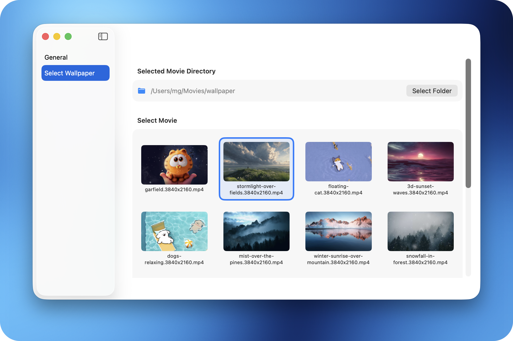

# Live Wallpaper

Live Wallpaper provides, as its name suggests, the capability of displaying live wallpaper on macOS, since the OS doesn't support that natively.
It comes with advanced capabilities like cross fading while looping or selecting a new random wallpaper periodically. 

> [!NOTE]  
> Note: This app is not being distributed anywhere, like the AppStore. You need to build and execute the app yourself.
> For example in XCode: Product > Archive... ; After building: Distribute > Custom > Copy App... ; Export it to your desired location.

> [!NOTE]  
> Note: This app doesn't provide any wallpapers!

# Gallery

