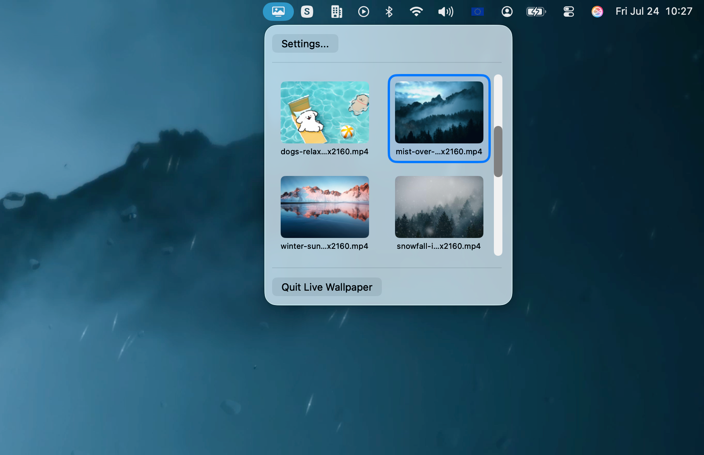
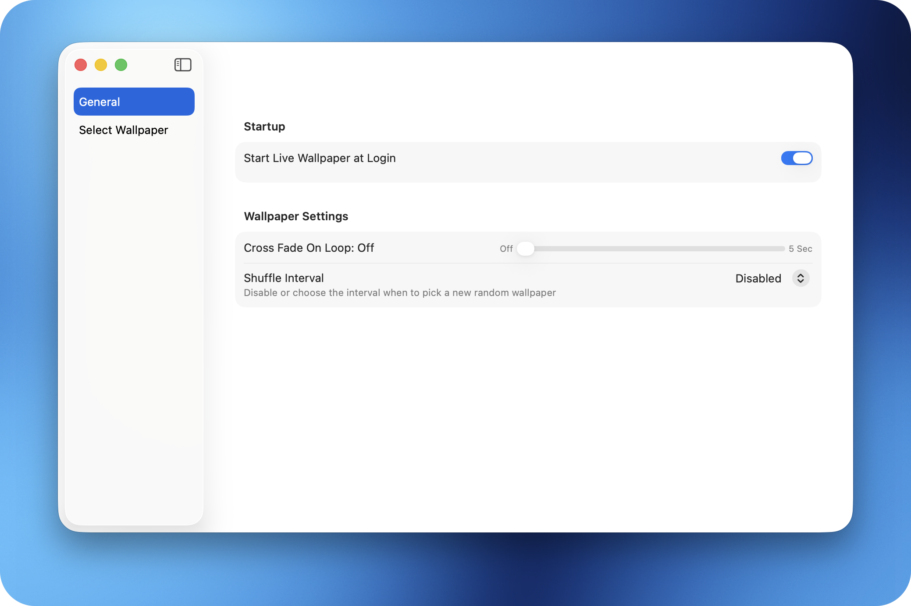

# Live Wallpaper

Live Wallpaper provides, as its name suggests, the capability of displaying live wallpaper on macOS, since the OS doesn't support that natively.
It comes with advanced capabilities like cross fading while looping or selecting a new random wallpaper periodically. 

> [!NOTE]  
> Note: This app doesn't provide any wallpapers!

# Getting Started

> [!NOTE]  
> Note: This app is not being distributed anywhere, like the AppStore. You need to build and execute the app yourself.
> For example in XCode: `Product > Archive...` ; After building: `Distribute > Custom > Copy App...` ; Export it to your desired location.

When you run the app the first and consecutive times, a small icon will appear on your status menu. 

To select any wallpaper, you need to configure a directory first, that provides the media files. 
For that, open `Settings... > Select Wallpaper > Select Folder`. 
Once selected, the available wallpapers will appear below or on click of the status menu item. 
Any changes will be saved automatically.

# Gallery

